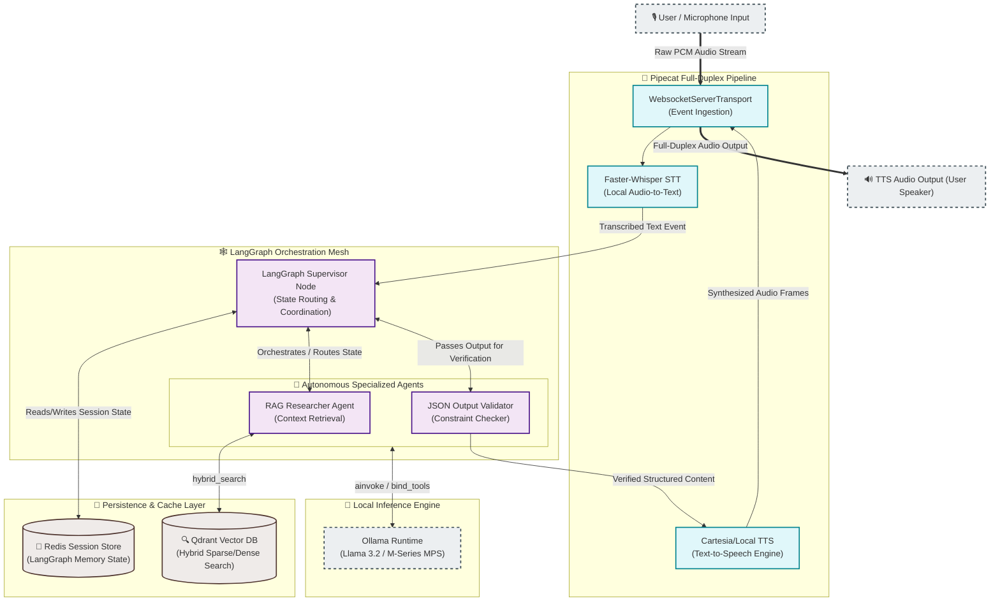

# 🎙️ Multi-Agent Voice AI Platform: Real-Time Agentic Mesh (Offline-First)

A production-grade, state-of-the-art **100% offline-first**, multi-agent voice AI architecture optimized for ultra-low latency execution on Apple Silicon (M-Series MPS hardware acceleration) and enterprise high-concurrency environments.

[](https://www.python.org/)
[](https://fastapi.tiangolo.com/)
[](https://github.com/langchain-ai/langgraph)
[](https://github.com/pipecat-ai/pipecat)
[](https://qdrant.tech/)
[](https://redis.io/)
[](https://ollama.com/)
[](https://www.docker.com/)

---

# Project Status


---

## 🎯 Architectural Philosophy & Engineering Highlights

This platform is engineered to address the toughest challenges in production Voice AI: **latency, state durability, privacy, and full-duplex session handling**.

* **Sub-100ms Pipeline Reactivity**: Powered by an event-driven **Pipecat** transport layer, bridging raw microphone streams through **Faster-Whisper STT** and structured **Cartesia TTS** with zero idle blocking.
* **Privacy-First Local Execution**: Orchestrated to leverage Apple Silicon's **MPS (Metal Performance Shaders)** and unified memory architecture, running large LLMs and local embedders completely offline at high token-per-second rates.
* **Resilient Socket Sessions**: Uses a thread-aware **Redis checkpointer** within LangGraph. If a WebSocket connection drops mid-speech, the session resumes seamlessly upon reconnection without losing agent memory state.
* **Enterprise-Grade Observability**: Integrates custom middleware that forces distributed trace propagation (`X-Trace-ID`) across asynchronous thread pools, with live **Prometheus instrumentation** (`/metrics`) and deep agent step-tracing via **Langfuse**.

---

## 🏗️ Core System Architecture

The flowchart below demonstrates the full-duplex data flow, showing how raw audio packets are ingested, parsed into semantic intent, run through an autonomous multi-agent state graph, and synthesized back to the user under a unified telemetry scope.



---

## 🌟 The 5 Pillars of the Architecture

### 1. Full-Duplex Voice Streaming (Pipecat + WebSockets)

* **Asynchronous Full-Duplex WebSockets**: Utilizes ASGI protocol directly under FastAPI to stream audio back and forth concurrently.
* **Event-Driven Transport**: Uses Pipecat's `WebsocketServerTransport` for ultra-low latency non-blocking frame transmission.
* **VAD & Echo Cancellation**: Locally processes voice activation detection (VAD) via Faster-Whisper to filter silence and avoid redundant model invocation.

### 2. Multi-Agent Orchestration (LangGraph + Persistence)

* **Stateful Agent Mesh**: Employs LangGraph's dynamic `StateGraph` which coordinates a **RAG Researcher** agent and a **JSON Output Validator** for deterministic voice responses.
* **State Persistence**: Implements thread-aware persistence (with LangGraph memory savers and `Redis` cache blueprints) that ensures conversational memory is maintained even when connection drops occur.

### 3. Local Privacy-First Inference (Ollama/M4 Optimized)

* **Apple Silicon & Local GPU Acceleration**: Fully integrates local LLM execution using `ChatOllama` over Metal Performance Shaders (MPS) or NVidia CUDA.
* **Resilient Request Boundaries**: Integrates custom `tenacity` exponential retry logic around local LLM calls to handle model reloading and GPU sleep cycles gracefully.

### 4. Hybrid RAG (Dense + Sparse/Splade Vector Search)

* **Qdrant Vector Database**: Utilizes an asynchronous client (`AsyncQdrantClient`) executing non-blocking hybrid searches (combining keyword BM25/sparse representations and semantic dense embeddings like `BAAI/bge-small-en-v1.5`).
* **Startup Verification**: Verifies collection availability and seeds initial schemas asynchronously during service startup to guarantee zero-downtime boots.

### 5. Deep Observability (Langfuse Integration)

* **Distributed Trace Tracking**: Injects dynamic transaction contexts (`X-Trace-ID`) propagated through FastAPI WebSockets, Celery workers, and LangGraph executors.
* **Telemetry Sync**: Logs model costs, token throughputs, search latencies, and agent transitions directly to **Langfuse** or your local self-hosted telemetry stack.

---

## 📂 Project Directory Structure

The repository is structured logically to separate the runtime backend, agent definition layers, configuration nodes, and test footprints:

```text
real_time_agentic_mesh_rag_based_offline/
├── .env.example                 # Centralized environment configuration blueprint
├── Dockerfile                   # Multi-stage optimized security-hardened Docker build
├── Makefile                     # Unified developer task runner (install, run, test, lint)
├── README.md                    # Production-grade system architecture and usage guide
├── docker-compose.yml           # Offline-first infrastructure deployment specification
├── pyproject.toml               # Modern PEP 621 Python package configuration (Hatchling)
├── uv.lock                      # Deterministic ultra-fast package manager lockfile
└── src/
    ├── agents/
    │   └── base/
    │       └── llm_factory.py   # ChatOllama & Structured LLM with built-in retry logic
    └── backend/
        ├── core/
        │   └── config.py        # Centralized Pydantic Settings type-safe configuration
        ├── main.py              # FastAPI WS ingress with Pipecat pipeline orchestration
        └── services/
            ├── agent_service.py # LangGraph StateGraph, supervisor, and tools schema
            └── cache_service.py # AsyncQdrantClient integration with hybrid search
```

---

## 🛠️ Technology Stack & Ports

| Component | Technology | Role | Port / Protocol | Connection Strategy |
| :--- | :--- | :--- | :--- | :--- |
| **Ingress Gate** | **FastAPI + Uvicorn** | ASGI Application Server & WebSocket Endpoints | `8000` / HTTP & WS | `ws://localhost:8000/ws/voice` |
| **Pipeline Runner** | **Pipecat AI** | Full-Duplex raw audio ingestion, VAD, and output | Native Stream | Memory-Mapped Transport |
| **Orchestrator** | **LangGraph** | Multi-Agent StateGraph with autonomous supervisor | Native DAG | Stateless Context Propagation |
| **Inference Core** | **Ollama** | Local LLM Runner (running `llama3.2` optimized) | `11434` / HTTP | `http://ollama:11434` (Docker) |
| **Vector Engine** | **Qdrant DB** | Hybrid semantic dense & keyword sparse search space | `6333` / HTTP | `http://qdrant:6333` |
| **State Memory** | **Redis Cache** | LangGraph conversational session persistence layer | `6379` / TCP | `redis://redis:6379/0` |
| **STT Engine** | **Faster-Whisper** | Ultra-fast local Audio-to-Text transcription | Local Process | CTranslate2 Execution |
| **TTS Engine** | **Cartesia / Local** | High-fidelity Text-to-Speech synthesis | External HTTPS / Local | Play Cartesia API Integration |

---

## 🚀 Getting Started

Ensure you have **macOS (Apple Silicon)** or a Linux host, **Docker / Docker Compose**, and the ultra-fast Rust-based Python package manager **`uv`** installed.

### 1. Environment Initialization

Clone this repository, then create and seed your local configuration:

```bash
# Clone the repository
git clone <repository-url>
cd real_time_agentic_mesh_rag_based_offline

# Create your .env file
cp .env.example .env
```

Open the newly created `.env` file and customize the configurations (e.g., API secrets, Cartesia keys, or model selections).

### 2. Fast Environment Build using `uv`

Leverage `uv` to instantiate virtual environments, lock dependencies, and install all dependencies in milliseconds:

```bash
# Verify uv installation and install project dependencies
make install
```

### 3. Spin up local Infrastructure

To launch the entire offline-first stack (including Qdrant, Ollama, Redis, and the API application) using Docker Compose:

```bash
# Start all services in daemon mode
make docker-up
```

Verify that the containers are healthy:

```bash
docker compose ps
```

The stack will spin up:

* `real_time_agentic_mesh_rag_based_offline_api` (API Engine on `:8000`)
* `real_time_agentic_mesh_rag_based_offline_qdrant` (Qdrant Vector DB on `:6333`)
* `real_time_agentic_mesh_rag_based_offline_ollama` (Local Ollama Engine on `:11434`)
* `voice_ai_redis` (Session checkpoint database on `:6379`)

### 4. Seed Local Vector Store

Upload your local knowledge assets, custom corporate policies, or support files into the Qdrant database:

```bash
# Seed the local Qdrant collection
make seed
```

---

## 🛡️ Security & Hardening

* **WebSocket Ingress Verification**: Active API Key validation is executed during the WebSocket upgrade handshake. The endpoint `/ws/voice` expects either an `X-API-Key` HTTP header or an `api_key` query parameter matching `API_KEY_SECRET` in `.env`.
* **Docker Container Isolation**: The production Docker image uses a multi-stage compilation to completely isolate build tools (`gcc`, `curl`) from the runtime stage.
* **Least-Privilege Execution**: The final Docker run stage drops standard system privileges and executes application code entirely under an unprivileged `appuser` (UID/GID `1000`).

---

## 📊 Live Metrics & Diagnostics

The platform exports rich, real-time telemetry pipelines to monitor concurrent activity:

* **Liveness & Health Check**: Exposed at `http://localhost:8000/health` with automated status verification.
* **Prometheus Metrics**: Exposed at `http://localhost:8000/metrics`. Standardized for Grafana scraping to log active socket counts, queue latency, and error trends.
* **Distributed Tracing (Langfuse)**: If `LANGFUSE_PUBLIC_KEY` and `LANGFUSE_SECRET_KEY` are provided in `.env`, the system automatically captures model tokens, per-step latency, and validation failures inside the LangGraph mesh.

---

## 📋 Development Tracking (TODO.md)

Phase 1: Voice & Pipeline (Completed)

[x] Pipecat WebSocket transport & STT foundation.

[x] Voice Activity Detection (VAD) configuration.

Phase 2: Orchestration (Completed)

[x] LangGraph Supervisor node and state machine.

[x] Checkpointer implementation for conversation persistence.

Phase 3: Hybrid RAG Search (In Progress)

[ ] Implement Sparse vector indexing (SPLADE) for enhanced keyword precision.

[ ] Configure Qdrant collection for hybrid vector support.

[ ] Fuse Dense/Sparse search results using Reciprocal Rank Fusion.

[ ] Bind hybrid search as an autonomous @tool in the RAG node.

Phase 4: Langfuse Observability (In Progress)

[ ] Inject LangfuseCallbackHandler into graph configuration.

[ ] Instrument WebSocket endpoints to capture end-to-end latency metrics.

Phase 5: Production Hardening (Planned)

[ ] Implement robust API Key authentication for WebSocket security.

[ ] Migrate memory persistence to Redis/Postgres for multi-worker support.

[ ] Finalize Text-to-Speech integration in the Pipecat pipeline.
